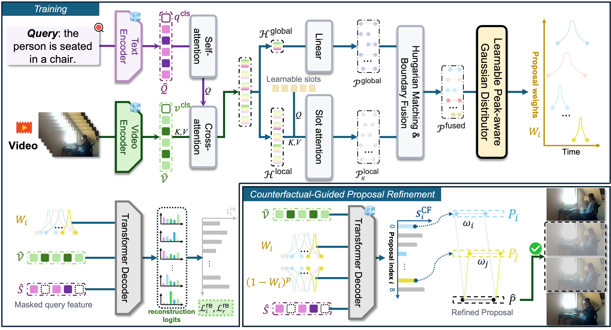

# PC-Net++

Official implementation of **PC-Net++: A Proposal-Centric Framework for
Weakly Supervised Compositional Moment Retrieval**, the journal extension of
PC-Net (NeurIPS 2025).

Video moment retrieval aims to localize the temporal segment described by a
natural-language query. PC-Net++ studies the weakly supervised setting, where
the model is trained with video-query pairs but without temporal annotations,
and explicitly evaluates whether the learned retriever generalizes to novel
query compositions and vocabulary.

PC-Net++ consists of two complementary stages:

- **Proposal learning (PC-Net).** A dual-granularity proposal generator (DPG)
  combines global and frame-level multimodal features; a proposal feature
  aggregator (PFA) performs semantic alignment and peak-aware Gaussian
  aggregation; and quality-margin regularization (QMR) improves proposal
  quality learning from partially relevant candidates.
- **Proposal decision (CPR).** Counterfactual proposal scoring (CF) reranks the
  learned candidates by comparing query reconstruction from proposal-retained
  and proposal-deleted evidence. Compatible boundary consensus (CBC) then
  refines the selected interval using score-weighted endpoints from compatible
  high-ranked proposals. CPR introduces no additional trainable parameters.



## Results

The following PC-Net+CPR (PC-Net++) results are reproduced by training from
scratch with this repository using a single run and no seed search.

**Charades-CG / ActivityNet-CG** (R1@0.5 / R1@0.7 / mIoU, %)

| Dataset | Test-Trivial | Novel-Composition | Novel-Word |
|---|---|---|---|
| Charades-CG | 58.11 / 27.91 / 49.20 | 43.78 / 18.19 / 39.27 | 51.22 / 25.47 / 44.53 |
| ActivityNet-CG | 31.35 / 15.89 / 36.74 | 21.05 / 8.88 / 29.61 | 24.01 / 11.73 / 31.16 |

**TACoS / Ego4D-NLQ** (R1@0.1 / R1@0.3 / R1@0.5 / mIoU, %)

| Dataset | Result |
|---|---|
| TACoS | 36.63 / 11.63 / 4.28 / 11.36 |
| Ego4D-NLQ | 6.75 / 2.17 / 0.86 / 2.56 |

**QVHighlights validation** (MR mAP@0.5 / @0.75 / Avg, R1@0.5 / @0.7,
HD mAP / HIT@1, %)

| Dataset | Result |
|---|---|
| QVHighlights | 17.05 / 6.97 / 8.64 / 15.03 / 6.65 / 24.31 / 30.19 |

## Getting started

### 1. Environment

The reference environment uses Python 3.9, PyTorch 2.0.1, and CUDA 11.7.

```bash
pip install -r requirements.txt
pip install fairseq==0.12.2 scikit-learn
python -c "import nltk; nltk.download('punkt')"
```

### 2. Data and features

The annotation files, split files, and GloVe vocabularies used by the code are
provided under `data/`. Large video features are not redistributed. Place the
required feature files at the paths documented in
[`data/README.md`](data/README.md).

The feature preparation protocols follow these baseline releases:

| Dataset | Reference |
|---|---|
| Charades-CG / ActivityNet-CG | [QMN](https://github.com/mingyao1120/QMN) |
| QVHighlights | [QD-DETR](https://github.com/wjun0830/QD-DETR) |
| TACoS / Ego4D-NLQ | [SnAG](https://github.com/fmu2/snag_release) |

Charades-CG and ActivityNet-CG are compositional splits of Charades-STA and
ActivityNet Captions introduced by
[Compositional Temporal Grounding](https://github.com/YYJMJC/Compositional-Temporal-Grounding).

After placing the raw feature files, build the deterministic frame-pooling
caches used by TACoS, Ego4D-NLQ, and QVHighlights:

```bash
python scripts/build_feature_cache.py --config configs/tacos.json \
    --output data/features/cache/tacos_c3d_200.npy \
    --index  data/features/cache/tacos_c3d_200.index.json
python scripts/build_feature_cache.py --config configs/ego4d.json \
    --output data/features/cache/ego4d_slowfast_200.npy \
    --index  data/features/cache/ego4d_slowfast_200.index.json
python scripts/build_feature_cache.py --config configs/qvhighlights.json \
    --output data/qvhighlights/cache/qv_val_75.npy \
    --index  data/qvhighlights/cache/qv_val_75.index.json
```

Charades-CG and ActivityNet-CG read their HDF5 feature files directly.

### 3. Train and evaluate from scratch

Prepare the video and GloVe features described above, then run one command for
each dataset:

```bash
python run.py --dataset charades      # TT / NC / NW
python run.py --dataset activitynet   # TT / NC / NW
python run.py --dataset tacos
python run.py --dataset ego4d
python run.py --dataset qvhighlights
```

Each command trains the proposal learner from scratch, performs per-epoch
model-selection evaluation with the complete CPR decision rule, evaluates the
selected model on the report split or splits, and writes local artifacts to
`outputs/<dataset>/`.

To evaluate a checkpoint produced by your own training run:

```bash
python run.py --dataset charades --eval-only
# or
python evaluate.py --dataset tacos \
    --checkpoint outputs/tacos/runner/<run>/model-best.pt
```

## Reproducibility

- Training and evaluation use fixed seeds and deterministic kernels, including
  `torch.use_deterministic_algorithms(True)` and
  `CUBLAS_WORKSPACE_CONFIG=:4096:8`.
- The CPR hyperparameters are declared in the `cpr` section of each dataset
  configuration and are shared by model-selection and final evaluation.
- The reference results use one run without seed search or metric-specific
  checkpoint selection.
- The experiments were verified on an NVIDIA RTX 4090 with PyTorch 2.0.1 and
  CUDA 11.7. Floating-point reductions on other hardware may produce small
  numerical differences.

## Repository layout

```text
PC-Net++/
├── run.py                 # train from scratch and run final evaluation
├── evaluate.py            # evaluate a checkpoint produced by this codebase
├── configs/               # dataset, training, and CPR configurations
├── src/
│   ├── models/pcnet.py    # PC-Net proposal-learning stage
│   ├── pcnetpp.py         # CF reranking and CBC boundary consensus
│   ├── runners/           # training and model-selection loops
│   ├── datasets/          # dataset loaders
│   └── evaluation/        # metrics and QVHighlights evaluator
├── scripts/build_feature_cache.py
├── figures/Method.png
└── data/                  # annotations and vocabulary metadata
```

## Citation

If you find this work useful, please cite the PC-Net conference paper:

```bibtex
@article{zhou2026pc,
  title={PC-Net: Weakly Supervised Compositional Moment Retrieval via Proposal-Centric Network},
  author={Zhou, Mingyao and Sun, Hao and Xie, Wei and Dong, Ming and Wang, Chengji and Ye, Mang},
  journal={Advances in Neural Information Processing Systems},
  volume={38},
  pages={132512--132538},
  year={2025}
}
```

## Acknowledgements

We thank the authors of QMN, QD-DETR, SnAG, Moment-DETR, and Compositional
Temporal Grounding for making their research artifacts available. Feature
preparation follows [QMN](https://github.com/mingyao1120/QMN) for Charades-CG
and ActivityNet-CG, [QD-DETR](https://github.com/wjun0830/QD-DETR) for
QVHighlights, and [SnAG](https://github.com/fmu2/snag_release) for TACoS and
Ego4D-NLQ. The Charades-CG and ActivityNet-CG splits are obtained from the
official
[Compositional Temporal Grounding](https://github.com/YYJMJC/Compositional-Temporal-Grounding)
repository. QVHighlights evaluation follows the official evaluator released
with [Moment-DETR](https://github.com/jayleicn/moment_detr).
